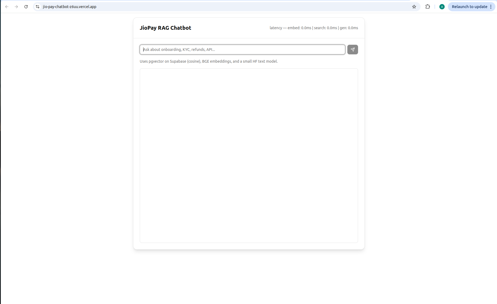

# ABOUT THIS PROJECT   
JIOPAY is a leading payment site associated with reliance industries . This is a student lead project by Harsh and Aamod tocreate a jio pay chatbot that T answers common of users .

# BENEFITS 
1. Fully Secure : The responses are only temporarily stored per session  
2. Completely Anonymous : The responses are deleted when session is deleted
3. Complete hands free setup : The Project is deployed at vercel and requires no external installation to use as is .  
4. Check citations with ease  

# HOW-TO-USE   
   1. Open link at vercel:  
     
   2. Type a query :  
      
   3. See citations :  
         
# License : MIT license  
Permission is hereby granted, free of charge, to any person obtaining a copy of this software and associated documentation files (the "Software"), to deal in the Software without restriction, including without limitation the rights to use, copy, modify, merge, publish, distribute, sublicense, and/or sell copies of the Software, and to permit persons to whom the Software is furnished to do so, subject to the following conditions:  

The above copyright notice and this permission notice shall be included in all copies or substantial portions of the Software.  

THE SOFTWARE IS PROVIDED "AS IS", WITHOUT WARRANTY OF ANY KIND, EXPRESS OR IMPLIED, INCLUDING BUT NOT LIMITED TO THE WARRANTIES OF MERCHANTABILITY,FITNESS FOR A PARTICULAR PURPOSE AND NONINFRINGEMENT. IN NO EVENT SHALL THE AUTHORS OR COPYRIGHT HOLDERS BE LIABLE FOR ANY CLAIM, DAMAGES OR OTHER LIABILITY, WHETHER IN AN ACTION OF CONTRACT, TORT OR OTHERWISE, ARISING FROM, OUT OF OR IN CONNECTION WITH THE SOFTWARE OR THE USE OR OTHER DEALINGS IN THE SOFTWARE.  
